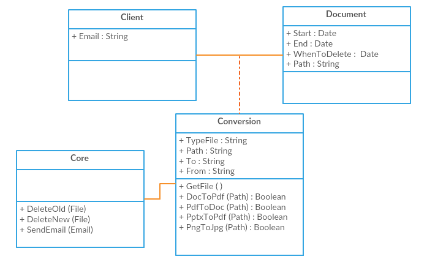
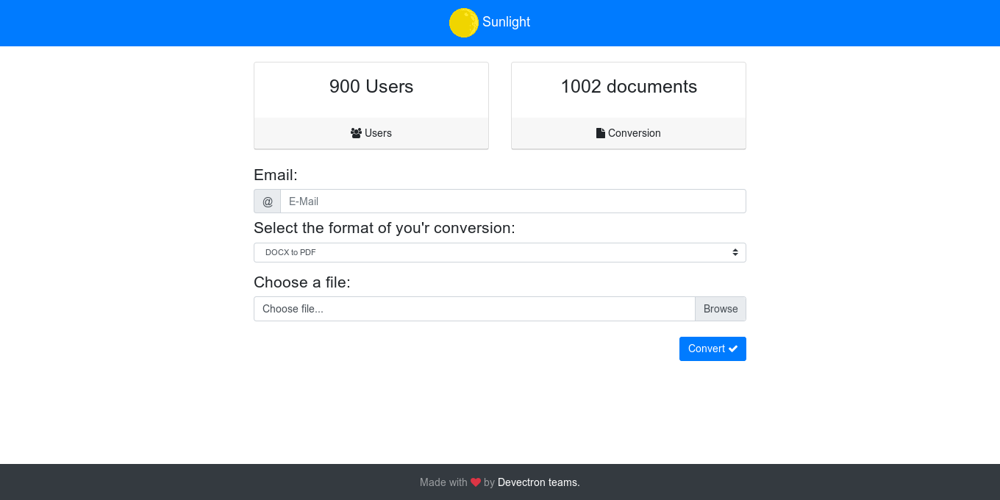

  
  
  
  

<a href="https://stark-wave-19861.herokuapp.com/">

</a>
# Sunlight

## Sommaire :
- Fonctionnement de l'application
- Architecture de l'application
  - Architecture global de l'application 
  - L'architecture de la couche donnée
  - Manière de gestion des demandes des clients
  - Les technologies choisie pour développer l'application.
  
### Fonctionnement de l'application :
-	Un client se rend sur la page d'accueil de l'application. Il y dépose son document, choisit les conversions à réaliser parmi celles disponibles et un e-mail de contact (facultatif).
-	Une fois la demande enregistrée, l'application envoie un message (facultativement : un e-mail) confirmant que l'opération est en cours et un lien vers une page résumant le statut de chaque conversion : en attente, en cours, terminé. Pour chaque statut, il est important de connaître le temps passé dans l'état courant.
-	Lorsqu'un document est converti, un lien est mis à disposition depuis la page de statut permettant de le télécharger. L’utilisateur dispose alors de 5 minutes pour le télécharger après quoi le document sera supprimé.
-	Quand le document a été converti, un message (facultativement : un e-mail) est envoyé à l'utilisateur avec le lien.
-	Pour chaque utilisateur, il est possible de réaliser seulement 2 conversions à la fois.

### L'architecture global de l'application:
Spring MVC est la bibliothèque d'infrastructure Spring traditionnelle pour la création d'applications Web Java, la structure Spring Web`MVC` fournit une architecture modèle-vue-contrôleur ([MVC](https://en.wikipedia.org/wiki/Model%E2%80%93view%E2%80%93controller)) et des composants prêts à l'emploi qui peuvent être utilisés pour développer des applications Web flexibles et des petits services, c'est pour cela qu'on a opté pour l'architecture `MVC` que l'architecture micro-services qui est utilisée dans les grands projects, et cela ne reflète pas sur le travaille demandé.

1. View: notre front-end (fondamentalement `HTML` code).
2. Controller: gérer les demandes `HTTP` (`POST`, `GET`).
3. Core: C'est le noyau de l'application qui gère la suppression des fichiers, envoi un e-mail au clients et la conversion des fichiers.
 

### Manière de gestion des demandes:
La maniere la plus efficace c'est d'utiliser `RWMutex` du package `sync` qui gere les `synchronisation` d'ou l'utilisation de plusieurs process (processus legers) permet de paralléliser le traitement et de l'executer rapidement.

### Technologies choisis pour développer l'application:
- Platforme de déploiement Cloud [heroku](https://www.heroku.com/) qui est une plateforme en tant que service (PaaS) permettant de déployer des applications sur le Cloud très facilement. 
- [Go](https://golang.org/).
- [convertapi](http://github.com/hihebark/convertapi-go) a fork from [convertapi](https://github.com/ConvertAPI/convertapi-go/)
- Langage Go,Platforme Vim.
- Convertion API [http://convertapi.com/](http://convertapi.com/) qui offre plusieurs types de conversion de documents.
- Email API [mailjet](https://www.mailjet.com/)

### Screenshot:

